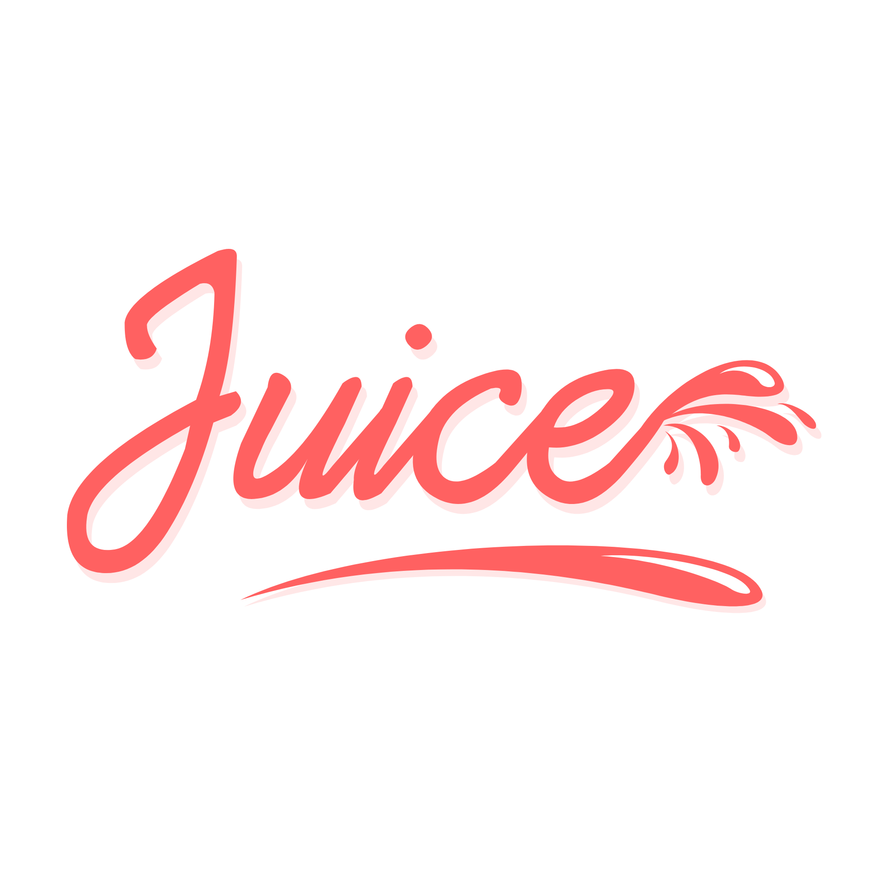

Take what you need, leave what you don't. Just remember, when you start your next project... just add Juice!

 

## Documentation
Documentation for the stable release is currently being written.

## Team
|  |  |
|:-------------------------------------------------------------------------------------------------------:|:-------------------------------------------------------------------------------------------------------------:|
| [CloudEight](https://github.com/cloudeight)                                                             | [Joe Mottershaw](https://github.com/joemottershaw)                                                            |

Along with the help from these [fine people](https://github.com/justaddjuice/juice/graphs/contributors)!

## Contributing
We appreciate you wanting to contribute to this project and would love to work with as many people as possible. All we ask is that you read this [style guidelines](https://github.com/cloudeight/style-guidelines) documentation project and please follow our [contribution guidelines](./.github/CONTRIBUTING.md) and [code of conduct](./.github/CODE_OF_CONDUCT.md).

## License
This project is open-sourced and licensed under the [MIT License](./LICENSE).
